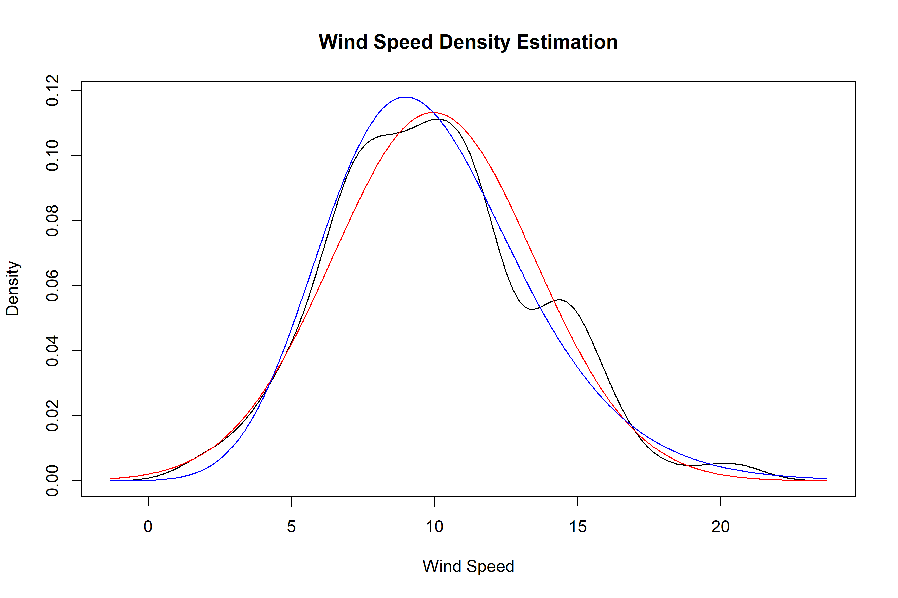

<!-- README.md is generated from README.Rmd. Please edit that file -->

# NLJ

<!-- badges: start -->
<!-- badges: end -->

The goal of nlj is to provide functions for statistical transformations,
distributions, and normalization methods, particularly leveraging the
Johnson SU distribution and the generalized inverse hyperbolic sine
transformation.

## Installation

You can install the development version of nlj from
[GitHub](https://github.com/) with:

``` r
# install.packages("pak")
pak::pak("shanedrabing/nlj")
```

## Example

Below are examples showcasing some key functions in the `nlj` package.

### Total Absolute Deviation from Theoretical CDF

The `qqtad` function calculates the total absolute deviation from a
theoretical cumulative distribution function (CDF):

``` r
library(nlj)

# Example probabilities
p <- c(0.1, 0.3, 0.6, 0.8)

# Calculate the total absolute deviation
qqtad(p)
#> [1] 0.4
```

### Generalized Inverse Hyperbolic Sine Transformation

The `gasinh` and `gsinh` functions apply and reverse the generalized
inverse hyperbolic sine transformation:

``` r
x <- c(-1, 0, 1, 2, 3)

# Apply generalized inverse hyperbolic sine transformation
transformed <- gasinh(x)
transformed
#> [1] -0.8813736  0.0000000  0.8813736  1.4436355  1.8184465

# Reverse the transformation
inverse_transformed <- gsinh(transformed)
inverse_transformed
#> [1] -1  0  1  2  3
```

### Johnson SU Distribution Functions

The Johnson SU distribution functions `djohnson`, `pjohnson`,
`qjohnson`, and `rjohnson` provide density, cumulative distribution,
quantile, and random variate generation capabilities.

#### Density

``` r
# Density at x = 0
djohnson(0, gamma = 0, delta = 1, xi = 0, lambda = 1)
#> [1] 0.3989423
```

#### Cumulative Distribution

``` r
# Cumulative probability at q = 0.5
pjohnson(0.5, gamma = 0, delta = 1, xi = 0, lambda = 1)
#> [1] 0.684817
```

#### Quantile Function

``` r
# Quantile for probability p = 0.5
qjohnson(0.5, gamma = 0, delta = 1, xi = 0, lambda = 1)
#> [1] 0
```

#### Random Deviate Generation

``` r
# Generate 5 random deviates
rjohnson(5, gamma = 0, delta = 1, xi = 0, lambda = 1)
#> [1]  2.3366987  0.5384061  0.5990896 -0.4338285 -0.6242223
```

### Z-Score Normalization

The `znorm` function normalizes a numeric vector using Z-score
normalization:

``` r
# Sample data
x <- c(1, 2, 3, 4, 5)

# Apply Z-score normalization
z_norm <- znorm(x)
z_norm$z  # Normalized values
#> [1] -1.2649111 -0.6324555  0.0000000  0.6324555  1.2649111

# Reverse the normalization
denormalized <- z_norm$denormalize(z_norm$z)
denormalized
#> [1] 1 2 3 4 5
```

### Johnson SU Normalization

The `zjohnson` function normalizes data using the Johnson SU
distribution:

``` r
# Normalize using Johnson SU distribution
johnson_norm <- zjohnson(x)
johnson_norm$z  # Normalized values
#> [1] -1.214548857 -0.592800127  0.009353697  0.592813535  1.158451731

# Reverse the normalization
denormalized_johnson <- johnson_norm$denormalize(johnson_norm$z)
denormalized_johnson
#> [1] 1 2 3 4 5
```

### Density Estimation Comparison

This example compares the density estimation of the original data
(`airquality$Wind`) with the densities after applying Z-score
normalization and Johnson SU normalization.

``` r
# Example data: Wind speed
x <- sort(airquality$Wind)
d <- density(x)

# Apply Z-score normalization and Johnson SU normalization
zn <- znorm(x)
zj <- zjohnson(x)

# Extract the density estimates
xd <- d$x
yd <- d$y
yn <- zn$fd(xd)
yj <- zj$fd(xd)

# Plot the density comparison
plot(range(xd), range(c(yd, yn, yj)), type = "n",
     main = "Wind Speed Density Estimation",
     xlab = "Wind Speed", ylab = "Density")
lines(xd, yd, col = "black")  # Original density
lines(xd, yn, col = "red")    # Z-score normalized density
lines(xd, yj, col = "blue")   # Johnson SU normalized density
legend(min(xd), max(yd),
       c("Kernel estimation", "Normal", "Johnson-SU"),
       col = c("black", "red", "blue"))
```


