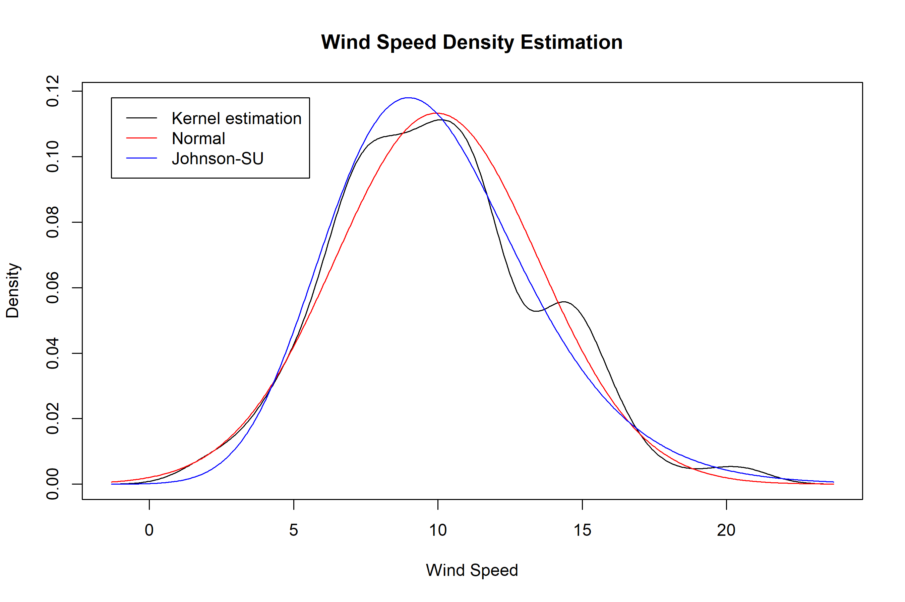

<!-- README.md is generated from README.Rmd. Please edit that file -->

# NLJ

The goal of nlj is to provide functions for statistical transformations,
distributions, and normalization methods, particularly leveraging the
Johnson SU distribution and the generalized inverse hyperbolic sine
transformation.

## Installation

You can install the development version of nlj from
[GitHub](https://github.com/) with:

``` r
# install.packages("pak")
pak::pak("shanedrabing/nlj")
```

## Examples

Below are examples showcasing some key functions in the `nlj` package.

### Johnson SU Distribution Functions

The Johnson SU distribution functions `djohnson`, `pjohnson`,
`qjohnson`, and `rjohnson` provide density, cumulative distribution,
quantile, and random variate generation capabilities.

#### Density

``` r
# Density at x = 0
nlj::djohnson(0, gamma = 0, delta = 1, xi = 0, lambda = 1)
#> [1] 0.3989423
```

#### Cumulative Distribution

``` r
# Cumulative probability at q = 0.5
nlj::pjohnson(0.5, gamma = 0, delta = 1, xi = 0, lambda = 1)
#> [1] 0.684817
```

#### Quantile Function

``` r
# Quantile for probability p = 0.5
nlj::qjohnson(0.5, gamma = 0, delta = 1, xi = 0, lambda = 1)
#> [1] 0
```

#### Random Deviate Generation

``` r
# Generate 5 random deviates
nlj::rjohnson(5, gamma = 0, delta = 1, xi = 0, lambda = 1)
#> [1]  0.4252297  1.7146467  0.2213620  0.3313443 -0.8268423
```

### Density Estimation Comparison

This example compares the density estimation of the original data
(`airquality$Wind`) with the densities after applying Z-score
normalization and Johnson SU normalization.

``` r
# Example data: Wind speed
x <- sort(airquality$Wind)
d <- density(x)

# Apply Z-score normalization and Johnson SU normalization
zn <- nlj::znorm(x)
zj <- nlj::zjohnson(x)

# Extract the density estimates
xd <- d$x
yd <- d$y
yn <- zn$fd(xd)
yj <- zj$fd(xd)

# Plot the density comparison
plot(range(xd), range(c(yd, yn, yj)), type = "n",
     main = "Wind Speed Density Estimation",
     xlab = "Wind Speed", ylab = "Density")
lines(xd, yd, col = "black")  # Original density
lines(xd, yn, col = "red")    # Z-score normalized density
lines(xd, yj, col = "blue")   # Johnson SU normalized density
legend(min(xd), max(c(yd, yn, yj)),
       c("Kernel estimation", "Normal", "Johnson-SU"),
       col = c("black", "red", "blue"),
       lwd = 1, bg = "white")
```


