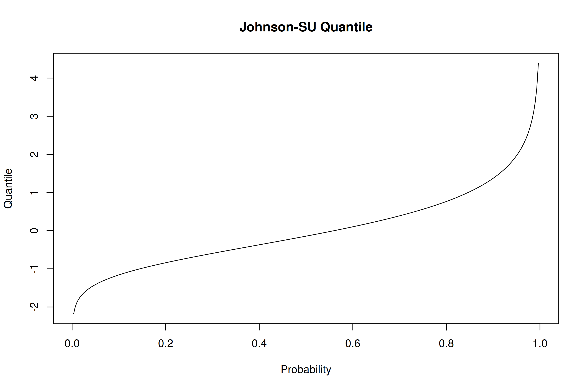

<!-- README.md is generated from README.Rmd. Please edit that file -->

# NLJ

The `nlj` package, named in honor of British statistician Norman Lloyd
Johnson, provides specialized functions for working with the Johnson-SU
(unbounded system) distribution. In addition to functions for Johnson-SU
distribution computations, the package includes automatic normalization
methods and a generalized transformation-based regression model
leveraging the inverse hyperbolic sine transformation.

## Installation

To install the development version of `nlj`, use the following commands:

``` r
# install.packages("devtools")
devtools::install_github("shanedrabing/nlj")
```

## Overview of Functions and Examples

The `nlj` package provides functions for working with Johnson-SU
distribution metrics, normalization utilities, and advanced regression
models. Below are examples that illustrate the primary functions
available in the package.

### Johnson-SU Distribution Functions

The Johnson-SU distribution functions (`djohnson`, `pjohnson`,
`qjohnson`, and `rjohnson`) allow for density, cumulative distribution,
quantile, and random variate generation. Each function has built-in
parameterization for the Johnson-SU distribution’s unique flexibility in
skewness and kurtosis adjustments.

#### Density

This function calculates the density of the Johnson-SU distribution for
a given range of values.

``` r
x <- seq(-pi, pi, length.out = 300)
d <- nlj::djohnson(x, gamma = -1.7, delta = 2.1, xi = -1.45, lambda = 1.45)
plot(x, d, type = "l",
     main = "Johnson-SU Density",
     xlab = "X", ylab = "Density")
```


#### Cumulative Distribution

Use `pjohnson` to compute cumulative probabilities, allowing the mapping
of quantiles within the distribution.

``` r
q <- seq(-pi, pi, length.out = 300)
p <- nlj::pjohnson(q, gamma = -1.7, delta = 2.1, xi = -1.45, lambda = 1.45)
plot(q, p, type = "l",
     main = "Johnson-SU Cumulative Distribution",
     xlab = "Quantile", ylab = "Probability")
```


#### Quantile Function

This function provides the quantile values for given cumulative
probabilities, useful for probabilistic analysis within the Johnson-SU
framework.

``` r
p <- seq(0, 1, length.out = 300)
q <- nlj::qjohnson(p, gamma = -1.7, delta = 2.1, xi = -1.45, lambda = 1.45)
plot(p, q, type = "l",
     main = "Johnson-SU Quantile",
     xlab = "Probability", ylab = "Quantile")
```



#### Random Deviate Generation

Generate random deviates from the Johnson-SU distribution with
`rjohnson`, suitable for simulation or resampling needs.

``` r
nlj::rjohnson(5, gamma = -1.7, delta = 2.1, xi = -1.45, lambda = 1.45)
#> [1]  0.1163819  2.4153221 -0.9112831 -0.1996155  0.4708389
```

### Automatic Normalization Functions

The package includes `znorm` and `zjohnson` functions, offering
automatic normalization, parameter binding, and denormalization
capabilities. These normalization utilities are particularly helpful in
preparing data for analysis or transformation to standardized forms.

#### Johnson-SU Normalization

The `zjohnson` function applies Johnson-SU normalization, suitable for
data that may not conform to a Gaussian distribution. This function
optimizes Johnson-SU parameters to best match the input data’s
distribution, offering a transformation that can handle skewed and
kurtotic data structures.

``` r
# Example data: Wind speed
x <- sort(airquality$Wind)
d <- density(x)

# Apply Johnson-SU normalization
zj <- nlj::zjohnson(x)

# Extract the density estimates
xd <- d$x
yd <- d$y
yj <- zj$fd(xd)

# Plot the density comparison
plot(range(xd), range(c(yd, yj)), type = "n",
     main = "Wind Speed Density Estimation",
     xlab = "Wind Speed", ylab = "Density")
lines(xd, yd, col = "black")  # Original density
lines(xd, yj, col = "red")   # Johnson-SU normalized density
legend(min(xd), max(c(yd, yj)),
       c("Kernel", "Johnson-SU"),
       col = c("black", "red"),
       lwd = 1, bg = "white")
```


### Generalized Asinh Transformation Model (GATM)

The Generalized Asinh Transformation Model (`lm.gat`) provides a
flexible approach to regression, using the generalized inverse
hyperbolic sine transformation. This model can improve fit quality by
adapting to non-linearity in data, especially when working with data
where simple linear models fall short.

#### Automatic Relationship Optimization

This example demonstrates the `lm.gat` function’s ability to fit a
non-linear model to data by leveraging the generalized asinh
transformation. Here, horsepower (`hp`) is used to predict miles per
gallon (`mpg`), and both a simple and GATM model are fitted to highlight
the latter’s ability to capture more complex patterns.

``` r
# Example data: Horsepower and miles per gallon (MPG)
i <- order(mtcars$hp)
x <- mtcars$hp[i]
y <- mtcars$mpg[i]

# Fit simple regression
m <- lm(y ~ x)

# Fit non-linear model
gat <- nlj::lm.gat(y ~ x, iterations = 3)

# Plot
plot(x, y, pch = 16,
     main = "Horsepower (HP) vs Miles Per Gallon (MPG)",
     xlab = "HP", ylab = "MPG")
lines(x, m$fitted.values, col = "red")
lines(x, gat$z, col = "blue")
legend(min(x), max(y),
       c("Simple", "GATM"),
       col = c("red", "blue"),
       lwd = 1, bg = "white")
```


#### Complex Nonlinear Interaction Optimization

In this example, `lm.gat` is used to fit a model with multiple
interacting terms. This showcases the function’s capacity to handle
complex, high-dimensional relationships where interactions between
variables (e.g., `hp`, `mpg`, `wt`) impact the outcome (`qsec`). This
process emphasizes `lm.gat`’s flexibility for optimizing non-linear and
interaction-heavy models.

To begin, let’s examine the results of naive linear regression model.

``` r
# Fit simple regression
m <- lm(qsec ~ hp * mpg * wt, mtcars)

summary(m)
#> 
#> Call:
#> lm(formula = qsec ~ hp * mpg * wt, data = mtcars)
#> 
#> Residuals:
#>     Min      1Q  Median      3Q     Max 
#> -1.5219 -0.5882 -0.0978  0.4013  3.1959 
#> 
#> Coefficients:
#>               Estimate Std. Error t value Pr(>|t|)
#> (Intercept) 14.0426771 10.9005197   1.288    0.210
#> hp           0.0017784  0.0590665   0.030    0.976
#> mpg          0.0249053  0.3921269   0.064    0.950
#> wt           0.2427188  3.4981471   0.069    0.945
#> hp:mpg      -0.0005924  0.0026322  -0.225    0.824
#> hp:wt        0.0016601  0.0179826   0.092    0.927
#> mpg:wt       0.1050975  0.1451373   0.724    0.476
#> hp:mpg:wt   -0.0003813  0.0008658  -0.440    0.664
#> 
#> Residual standard error: 1.102 on 24 degrees of freedom
#> Multiple R-squared:  0.7055, Adjusted R-squared:  0.6196 
#> F-statistic: 8.215 on 7 and 24 DF,  p-value: 4.052e-05
```

In the next code block, we apply `lm.gat` to fit a more flexible,
non-linear model. Unlike the previous linear model, `lm.gat` uses a
generalized asinh transformation to better capture non-linear
interactions in the data. This approach is particularly effective for
capturing complex relationships.

``` r
# Fit complex regression
gat <- nlj::lm.gat(qsec ~ hp * mpg * wt, mtcars,
                   iterations = 6, penalty = 1e-9)

summary(gat$fit)
#> 
#> Call:
#> stats::lm(formula = formula, data = mut)
#> 
#> Residuals:
#>        Min         1Q     Median         3Q        Max 
#> -2.506e-03 -7.267e-04 -2.282e-05  6.394e-04  2.601e-03 
#> 
#> Coefficients:
#>               Estimate Std. Error  t value Pr(>|t|)    
#> (Intercept)  2.130e+00  1.880e-03 1133.138  < 2e-16 ***
#> hp          -4.703e-04  2.501e-04   -1.881  0.07220 .  
#> mpg         -2.400e-03  2.681e-04   -8.952 4.08e-09 ***
#> wt          -7.029e-03  6.350e-04  -11.069 6.52e-11 ***
#> hp:mpg       1.682e-06  4.890e-05    0.034  0.97284    
#> hp:wt       -3.599e-04  1.176e-04   -3.061  0.00537 ** 
#> mpg:wt      -7.182e-04  9.360e-05   -7.673 6.55e-08 ***
#> hp:mpg:wt   -8.171e-05  1.108e-05   -7.371 1.30e-07 ***
#> ---
#> Signif. codes:  0 '***' 0.001 '**' 0.01 '*' 0.05 '.' 0.1 ' ' 1
#> 
#> Residual standard error: 0.001326 on 24 degrees of freedom
#> Multiple R-squared:  0.9224, Adjusted R-squared:  0.8997 
#> F-statistic: 40.74 on 7 and 24 DF,  p-value: 8.352e-12
```
