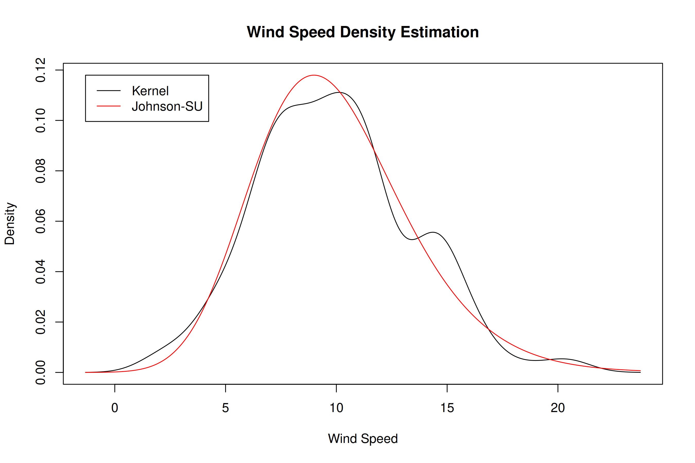

<!-- README.md is generated from README.Rmd. Please edit that file -->

# NLJ

The `nlj` package, named in honor of British statistician Norman Lloyd
Johnson, provides specialized functions for working with the Johnson-SU
(unbounded system) distribution. In addition to functions for Johnson-SU
distribution computations, the package includes automatic normalization
methods and a generalized transformation-based regression model
leveraging the inverse hyperbolic sine transformation.

## Installation

To install the development version of `nlj`, use the following commands:

``` r
# install.packages("devtools")
devtools::install_github("shanedrabing/nlj")
```

## Overview of Functions and Examples

The `nlj` package provides functions for working with Johnson-SU
distribution metrics, normalization utilities, and advanced regression
models. Below are examples that illustrate the primary functions
available in the package.

### Johnson-SU Distribution Functions

The Johnson-SU distribution functions (`djohnson`, `pjohnson`,
`qjohnson`, and `rjohnson`) allow for density, cumulative distribution,
quantile, and random variate generation. Each function has built-in
parameterization for the Johnson-SU distribution’s unique flexibility in
skewness and kurtosis adjustments.

#### Density

This function calculates the density of the Johnson-SU distribution for
a given range of values.

``` r
x <- seq(-pi, pi, length.out = 300)
d <- nlj::djohnson(x, gamma = -1.7, delta = 2.1, xi = -1.45, lambda = 1.45)
plot(x, d, type = "l",
     main = "Johnson-SU Density",
     xlab = "X", ylab = "Density")
```


#### Cumulative Distribution

Use `pjohnson` to compute cumulative probabilities, allowing the mapping
of quantiles within the distribution.

``` r
q <- seq(-pi, pi, length.out = 300)
p <- nlj::pjohnson(q, gamma = -1.7, delta = 2.1, xi = -1.45, lambda = 1.45)
plot(q, p, type = "l",
     main = "Johnson-SU Cumulative Distribution",
     xlab = "Quantile", ylab = "Probability")
```


#### Quantile Function

This function provides the quantile values for given cumulative
probabilities, useful for probabilistic analysis within the Johnson-SU
framework.

``` r
p <- seq(0, 1, length.out = 300)
q <- nlj::qjohnson(p, gamma = -1.7, delta = 2.1, xi = -1.45, lambda = 1.45)
plot(p, q, type = "l",
     main = "Johnson-SU Quantile",
     xlab = "Probability", ylab = "Quantile")
```


#### Random Deviate Generation

Generate random deviates from the Johnson-SU distribution with
`rjohnson`, suitable for simulation or resampling needs.

``` r
nlj::rjohnson(5, gamma = -1.7, delta = 2.1, xi = -1.45, lambda = 1.45)
#> [1]  0.1163819  2.4153221 -0.9112831 -0.1996155  0.4708389
```

### Automatic Normalization Functions

The package includes `znorm` and `zjohnson` functions, offering
automatic normalization, parameter binding, and denormalization
capabilities. These normalization utilities are particularly helpful in
preparing data for analysis or transformation to standardized forms.

#### Z-score Normalization

The `znorm` function applies traditional Z-score normalization. It
computes the mean and standard deviation of the input data and offers
built-in functions for denormalizing and calculating Z-score-based
densities.

``` r
# Example data: Wind speed
x <- sort(airquality$Wind)
d <- density(x)

# Apply Z-score normalization
zn <- nlj::znorm(x)

# Extract the density estimates
xd <- d$x
yd <- d$y
yn <- zn$fd(xd)

# Plot the density comparison
plot(range(xd), range(c(yd, yn)), type = "n",
     main = "Wind Speed Density Estimation",
     xlab = "Wind Speed", ylab = "Density")
lines(xd, yd, col = "black")  # Original density
lines(xd, yn, col = "red")    # Z-score normalized density
legend(min(xd), max(c(yd, yn)),
       c("Kernel", "Normal"),
       col = c("black", "red"),
       lwd = 1, bg = "white")
```


#### Johnson-SU Normalization

The `zjohnson` function applies Johnson-SU normalization, suitable for
data that may not conform to a Gaussian distribution. This function
optimizes Johnson-SU parameters to best match the input data’s
distribution, offering a transformation that can handle skewed and
kurtotic data structures.

``` r
# Apply Johnson-SU normalization
zj <- nlj::zjohnson(x)

# Extract the density estimates
yj <- zj$fd(xd)

# Plot the density comparison
plot(range(xd), range(c(yd, yj)), type = "n",
     main = "Wind Speed Density Estimation",
     xlab = "Wind Speed", ylab = "Density")
lines(xd, yd, col = "black")  # Original density
lines(xd, yj, col = "blue")   # Johnson-SU normalized density
legend(min(xd), max(c(yd, yn, yj)),
       c("Kernel", "Johnson-SU"),
       col = c("black", "blue"),
       lwd = 1, bg = "white")
```



### Generalized Asinh Transformation Model (GATM)

The Generalized Asinh Transformation Model (`lm.gat`) provides a
flexible approach to regression, using the generalized inverse
hyperbolic sine transformation. This model can improve fit quality by
adapting to non-linearity in data, especially when working with data
where simple linear models fall short.

``` r
# Example data: Horsepower and miles per gallon (MPG)
i <- order(mtcars$hp)
x <- mtcars$hp[i]
y <- mtcars$mpg[i]

# Fit simple regression
m <- lm(y ~ x)

# Fit non-linear model
gat <- nlj::lm.gat(y ~ x)

# Plot
plot(x, y, pch = 16,
     main = "Horsepower (HP) vs Miles Per Gallon (MPG)",
     xlab = "HP", ylab = "MPG")
lines(x, m$fitted.values, col = "red")
lines(x, gat$z, col = "blue")
legend(min(x), max(y),
       c("Simple", "GATM"),
       col = c("red", "blue"),
       lwd = 1, bg = "white")
```


